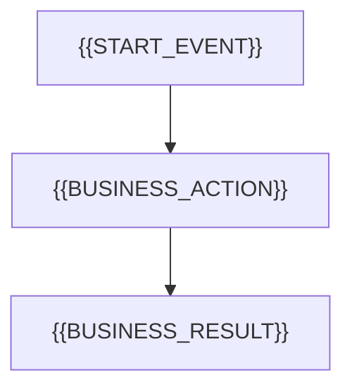

## {{SECTION_NO}}、业务动作全链路影响分析

### 1. 分析范围与事实来源

| 范围 | 内容 | 来源 |
|---|---|---|

### 2. 业务动作目录

| 动作ID | 动作名称 | 触发主体 | 入口或事件 | 前置状态 | 作用范围 | 来源 |
|---|---|---|---|---|---|---|

### 3. 影响面清单

| 影响面ID | 项目业务名称 | 对象类型 | 归属模块或系统 | 适用动作ID | 独立性依据 | 允许的变化方式 | 来源 |
|---|---|---|---|---|---|---|---|

### 4. 事件时点清单

| 时点ID | 项目时点名称 | 适用动作ID | 触发事件 | 前置条件 | 责任主体 | 同步或异步 | 来源 |
|---|---|---|---|---|---|---|---|

### 5. 总览流程图

<!-- 仅在多个动作或分支关系需要总览时保留，并替换所有占位内容。 -->



### 6. 动作 {{ACTION_ID}}：{{ACTION_NAME}}

#### 6.1 动作定义

| 项目 | 内容 |
|---|---|
| 业务目的 | {{ACTION_PURPOSE}} |
| 触发主体 | {{ACTOR}} |
| 入口或事件 | {{ENTRY_OR_EVENT}} |
| 前置状态 | {{PRE_STATE}} |
| 输入 | {{INPUT}} |
| 权限与规则 | {{RULES}} |

#### 6.2 跨参与者时序图

<!-- 参与者、消息、分支和时点从当前项目动态产生，不保留示例占位内容。 -->

```mermaid
sequenceDiagram
    actor Actor as {{ACTOR}}
    participant Owner as {{ACTION_OWNER}}
    participant Dependency as {{DEPENDENCY}}
    Actor->>Owner: {{TRIGGER}}
    Owner->>Dependency: {{BUSINESS_CALL}}
    Dependency-->>Owner: {{BUSINESS_RESULT}}
    Owner-->>Actor: {{USER_FEEDBACK}}
```

#### 6.3 业务动作影响矩阵

<!-- 将 DYNAMIC_EFFECT_COLUMNS 展开为影响面清单中与本动作有关的多个独立表头，并同步增加对应数量的分隔单元格；不得把占位符保留为一个合并影响列。 -->

| 场景ID | 动作ID/名称 | 触发主体 | 入口或事件 | 前置状态 | 触发条件 | {{DYNAMIC_EFFECT_COLUMNS}} | 最终状态 | 原子边界/一致性 | 失败后保留 | 回滚或补偿 | 恢复/重试/幂等 | 通知/操作记录 | 规则/验收来源 |
|---|---|---|---|---|---|---|---|---|---|---|---|---|---|

#### 6.4 异常与补偿矩阵

| 异常ID | 动作ID/场景ID | 失败时点 | 失败影响面 | 已提交结果 | 独立保留 | 同步回滚 | 异步补偿 | 用户反馈 | 恢复入口 | 重试/幂等 | 通知/操作记录 | 来源 |
|---|---|---|---|---|---|---|---|---|---|---|---|---|

#### 6.5 状态变化矩阵

| 场景ID | 状态对象 | 动作前状态 | 触发事件/时点 | 动作后状态 | 是否可回退 | 回退条件 | 来源 |
|---|---|---|---|---|---|---|---|

### 7. 待确认问题

| 编号 | 动作/场景 | 待确认内容 | 影响范围 | 来源 | 状态 |
|---|---|---|---|---|---|
