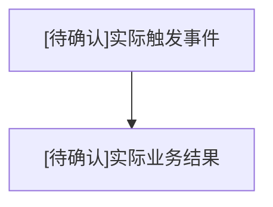
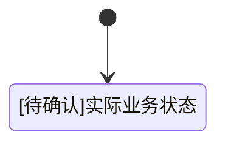

# {{MODULE_NAME}}业务流程与状态流转

## 一、业务流程

### 1. 流程目标

[待确认]

### 2. 参与角色

| 角色 | 流程职责 |
|---|---|

### 3. 前置条件与触发

| 类型 | 内容 | 来源 |
|---|---|---|

### 4. 主流程

#### 操作路径

| 步骤ID | 顺序 | 执行角色 | 页面/入口 | 用户/系统动作 | 输出 |
|---|---|---|---|---|---|

#### 条件与反馈

| 步骤ID | 前置状态 | 输入 | 业务规则与权限校验 | 系统反馈 |
|---|---|---|---|---|

#### 状态与后续处理

| 步骤ID | 状态变化 | 通知/时限 |
|---|---|---|

### 5. 流程图或时序图（按需）

<!-- 按路径、分支或跨参与者顺序选择图形；已有图表达清楚时保留。简单流程可只用步骤表。 -->

### 6. 分支流程

| 分支ID | 触发条件 | 处理步骤 | 结果 | 返回主流程位置 |
|---|---|---|---|---|

### 7. 异常流程

| 异常ID | 异常 | 触发条件 | 系统处理 | 用户反馈 | 恢复方式 |
|---|---|---|---|---|---|

### 8. 后置条件

[待确认]

### 9. 时限、通知与补偿

| 场景ID | 触发步骤/状态 | 时限或超时条件 | 通知对象与渠道 | 超时处理 | 补偿/回滚 | 操作记录 |
|---|---|---|---|---|---|---|

## 二、状态流转

### 1. 状态对象

[待确认]

### 2. 状态定义

#### 状态含义

| 状态ID | 状态名称 | 业务含义 | 进入条件 | 是否终态 |
|---|---|---|---|---|

#### 状态下的操作与展示

| 状态ID | 可编辑范围 | 进入动作 | 退出动作 | 页面展示说明 |
|---|---|---|---|---|

### 3. 状态流转表

#### 从什么状态到什么状态

| 流转ID | 当前状态 | 触发类型 | 触发动作 | 目标状态 |
|---|---|---|---|---|

#### 谁能执行、改变什么

| 流转ID | 执行角色 | 前置条件 | 数据影响 |
|---|---|---|---|

#### 失败、重复触发与验收

| 流转ID | 失败与恢复 | 通知 | 幂等/重复触发 | 验收ID |
|---|---|---|---|---|

### 4. 状态流转图

### 5. 各角色状态展示与操作

| 状态 | 角色 | 展示文案 | 可执行操作 | 禁止操作 | 页面提示 |
|---|---|---|---|---|---|

### 6. 取消、撤回与回退

| 场景 | 发起角色 | 条件 | 目标状态 | 数据处理 | 用户反馈 |
|---|---|---|---|---|---|

### 7. 超时、自动流转与并发控制

| 规则ID | 当前状态 | 触发条件/时限 | 自动动作 | 目标状态 | 并发冲突处理 | 重复提交处理 | 通知与记录 |
|---|---|---|---|---|---|---|---|

### 8. 异常状态

只记录项目明确存在的稳定业务异常状态。网络超时、加载中、请求失败和结果未知写入页面反馈或异常流程；不适用时说明原因。

| 异常状态 | 触发条件 | 可见角色 | 处理方式 | 恢复状态 |
|---|---|---|---|---|

## 三、关联需求、来源与待确认问题

### 1. 关联需求与来源

| 步骤/分支 | 需求ID | 规则ID | 来源 |
|---|---|---|---|

### 2. 待确认问题

| 编号 | 内容 | 来源 | 状态 |
|---|---|---|---|
