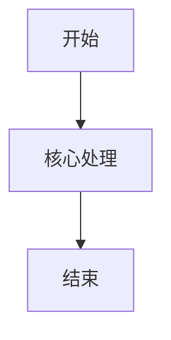
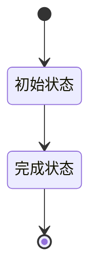

# {{MODULE_NAME}}业务流程推演

## 一、推演范围与依据

### 1. 推演目标

[待确认]

### 2. 参与身份与业务对象

| 身份/系统 | 流程职责 | 数据范围 | 主要业务对象 |
|---|---|---|---|

### 3. 前置条件与来源

| 类型 | 内容 | 来源 | 影响流程 |
|---|---|---|---|

## 二、流程清单

| 流程ID | 流程名称 | 类型 | 业务目标 | 触发条件 | 参与身份 | 起始状态 | 结束状态 | 关联功能ID | 关联数据用例ID |
|---|---|---|---|---|---|---|---|---|---|

没有某类流程时，填写“不适用”及依据，不得留空。

## 三、主流程

### 1. 主流程步骤

| 步骤ID | 顺序 | 时间/触发节点 | 执行身份/方式 | 页面/入口 | 前置状态与关键数据 | 输入 | 用户/系统动作 | 规则与权限校验 | 系统反馈 | 输出与数据变化 | 目标状态 | 通知/时限/记录 | 下一步 |
|---|---|---|---|---|---|---|---|---|---|---|---|---|---|

### 2. 主流程图

## 四、分支流程

| 分支ID | 来源步骤 | 判断条件 | 执行身份 | 分支步骤 | 数据与状态变化 | 页面反馈 | 返回主流程位置/独立终点 | 关联数据用例ID |
|---|---|---|---|---|---|---|---|---|

## 五、辅助流程

| 辅助流程ID | 辅助操作 | 来源步骤/页面 | 执行身份 | 前置条件 | 处理步骤 | 对主对象的数据影响 | 对主流程的影响 | 结果与反馈 | 关联数据用例ID |
|---|---|---|---|---|---|---|---|---|---|

## 六、异常流程

| 异常流程ID | 来源步骤 | 异常类型 | 触发条件 | 系统处理 | 数据处理 | 状态处理 | 用户反馈 | 恢复/补偿/回滚 | 关联数据用例ID |
|---|---|---|---|---|---|---|---|---|---|

## 七、状态流转

### 1. 状态对象

[待确认]

### 2. 状态定义

| 状态ID | 状态名称 | 业务含义 | 进入条件 | 可编辑范围 | 进入动作 | 退出动作 | 是否终态 | 页面展示说明 |
|---|---|---|---|---|---|---|---|---|

### 3. 状态流转表

| 流转ID | 当前状态 | 触发类型 | 来源步骤/操作 | 执行身份 | 前置条件 | 目标状态 | 数据影响 | 失败与恢复 | 通知 | 幂等/重复触发 | 数据用例ID | 验收ID |
|---|---|---|---|---|---|---|---|---|---|---|---|---|

### 4. 状态流转图

### 5. 各身份状态展示与操作

| 状态 | 身份 | 展示文案 | 可执行操作 | 禁止操作 | 页面提示 |
|---|---|---|---|---|---|

### 6. 取消、撤回与回退

| 场景 | 发起身份 | 条件 | 目标状态 | 数据处理 | 用户反馈 | 关联流程ID |
|---|---|---|---|---|---|---|

### 7. 超时、自动流转与并发控制

| 规则ID | 当前状态 | 触发条件/时限 | 自动动作 | 目标状态 | 并发冲突处理 | 重复提交处理 | 通知与记录 |
|---|---|---|---|---|---|---|---|

### 8. 异常状态

| 异常状态 | 触发条件 | 可见身份 | 处理方式 | 恢复状态 |
|---|---|---|---|---|

## 八、覆盖与追踪

| 需求/功能ID | 主流程步骤ID | 分支/辅助/异常流程ID | 状态流转ID | 规则ID | 字段ID | 页面ID | 数据用例ID | 验收ID | 覆盖结论 |
|---|---|---|---|---|---|---|---|---|---|

## 九、回填与待确认问题

### 1. 推演发现的文档缺口

| 缺口ID | 缺失或冲突内容 | 应回填文档 | 影响流程/页面/用例 | 处理状态 |
|---|---|---|---|---|

### 2. 待确认问题

| 编号 | 内容 | 来源 | 影响 | 状态 |
|---|---|---|---|---|
