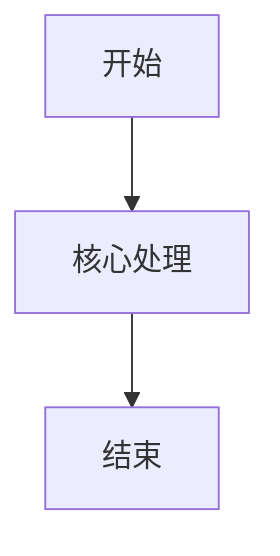

# {{MODULE_NAME}}业务流程

## 1. 流程目标

[待确认]

## 2. 参与角色

| 角色 | 流程职责 |
|---|---|

## 3. 前置条件与触发

| 类型 | 内容 | 来源 |
|---|---|---|

## 4. 主流程

| 步骤ID | 顺序 | 执行角色 | 页面/入口 | 前置状态 | 输入 | 用户/系统动作 | 业务规则与权限校验 | 系统反馈 | 输出 | 状态变化 | 通知/时限 |
|---|---|---|---|---|---|---|---|---|---|---|---|

## 5. 流程图

## 6. 分支流程

| 分支ID | 触发条件 | 处理步骤 | 结果 | 返回主流程位置 |
|---|---|---|---|---|

## 7. 异常流程

| 异常ID | 异常 | 触发条件 | 系统处理 | 用户反馈 | 恢复方式 |
|---|---|---|---|---|---|

## 8. 后置条件

[待确认]

## 9. 时限、通知与补偿

| 场景ID | 触发步骤/状态 | 时限或超时条件 | 通知对象与渠道 | 超时处理 | 补偿/回滚 | 操作记录 |
|---|---|---|---|---|---|---|

## 10. 关联需求与来源

| 步骤/分支 | 需求ID | 规则ID | 来源 |
|---|---|---|---|
