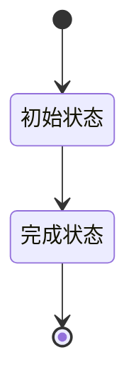

# {{MODULE_NAME}}状态流转

## 1. 状态对象

[待确认]

## 2. 状态定义

| 状态ID | 状态名称 | 业务含义 | 进入条件 | 可编辑范围 | 进入动作 | 退出动作 | 是否终态 | 页面展示说明 |
|---|---|---|---|---|---|---|---|---|

## 3. 状态流转表

| 流转ID | 当前状态 | 触发类型 | 触发动作 | 执行角色 | 前置条件 | 目标状态 | 数据影响 | 失败与恢复 | 通知 | 幂等/重复触发 | 验收ID |
|---|---|---|---|---|---|---|---|---|---|---|---|

## 4. 状态流转图

## 5. 各角色状态展示与操作

| 状态 | 角色 | 展示文案 | 可执行操作 | 禁止操作 | 页面提示 |
|---|---|---|---|---|---|

## 6. 取消、撤回与回退

| 场景 | 发起角色 | 条件 | 目标状态 | 数据处理 | 用户反馈 |
|---|---|---|---|---|---|

## 7. 超时、自动流转与并发控制

| 规则ID | 当前状态 | 触发条件/时限 | 自动动作 | 目标状态 | 并发冲突处理 | 重复提交处理 | 通知与记录 |
|---|---|---|---|---|---|---|---|

## 8. 异常状态

| 异常状态 | 触发条件 | 可见角色 | 处理方式 | 恢复状态 |
|---|---|---|---|---|

## 9. 来源与待确认问题

| 编号 | 内容 | 来源 | 状态 |
|---|---|---|---|
