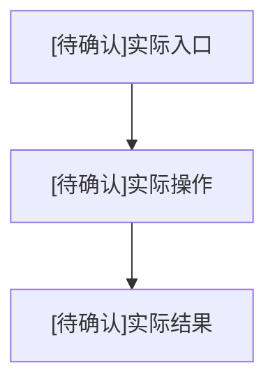

# {{ENDPOINT_NAME}}端口核心业务旅程

## 1. 旅程概览

| 项目 | 内容 |
|---|---|
| 旅程名称 | [待确认] |
| 端口 | {{ENDPOINT_NAME}} |
| 适用身份 | {{ENDPOINT_ROLES}} |
| 目标 | [待确认] |
| 触发条件 | [待确认] |
| 前置条件 | [待确认] |
| 完成标准 | [待确认] |

## 2. 主旅程

### 2.1 用户怎样完成操作

| 阶段 | 执行身份 | 用户目标 | 入口/页面 | 用户动作 |
|---|---|---|---|---|

### 2.2 各阶段的输入与结果

| 阶段 | 输入 | 系统反馈 | 输出 | 关联需求 |
|---|---|---|---|---|

## 3. 旅程图（按需）

<!-- 根据实际路径或交接顺序选择流程图、时序图或不配图；用真实名称替换示例节点。 -->

## 4. 跨身份与跨端口衔接

| 阶段 | 发起身份/端口 | 接收身份/端口 | 交接对象 | 携带信息 | 状态变化 | 通知 |
|---|---|---|---|---|---|---|

## 5. 分支与异常旅程

| 场景 | 触发条件 | 用户行为 | 系统处理 | 返回路径 |
|---|---|---|---|---|

## 6. 体验目标

| 阶段 | 体验目标 | 判断标准 |
|---|---|---|

## 7. 来源与待确认问题

| 编号 | 内容 | 来源 | 状态 |
|---|---|---|---|
