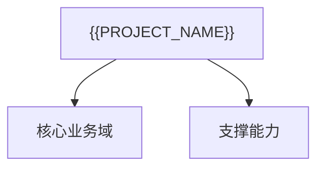

# {{PROJECT_NAME}}产品功能架构

## 1. 架构说明

[待确认]

## 2. 功能架构图

## 3. 功能分层

| 功能ID | 一级模块 | 二级模块 | 功能点 | 主要角色 | 端口 | 关联文档 |
|---|---|---|---|---|---|---|

## 4. 模块职责与边界

| 模块ID | 模块 | 核心职责 | 边界 | 服务角色 | 上下游 |
|---|---|---|---|---|---|
{{MODULE_TABLE_ROWS}}

## 5. 角色与端口覆盖

| 模块 | {{ROLE_HEADER_CELLS}} |
|---|{{ROLE_SEPARATOR_CELLS}}|

## 6. 模块依赖关系

[待确认]

## 7. 来源与待确认问题

| 编号 | 内容 | 来源 | 状态 |
|---|---|---|---|
